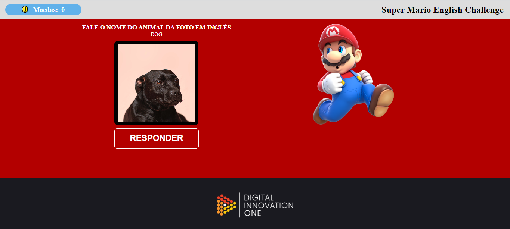

## 👨‍💻 Desafio de Projeto JS: Criando um Sistema de Reconhecimento de Voz para Aprender Animais em Inglês
Projeto extra da Formação JavaScript Developer, ministrado pelo Felipe Aguiar da plataforma DIO.  
O objetivo desse projeto é criar um Sistema de Reconhecimento de Voz para Aprender alguns animais em Inglês.

## 💻 Tecnologias usadas:

  
  
  

## Preview:

- Venha ver como ficou o projeto acessando [aqui nesse link do GithubPages](https://marcoswinther.github.io/project-html-css-js-learning-animals-in-english/)

## ⚙ Execução desse projeto:
1. **Clonar Repósitório:** basta utilizar o comando `git clone` para clonar esse projeto e salvar na máquina e depois executar o arquivo `index.html`.
2. **GitHubPages:** pode também acessar o projeto nesse [link](https://marcoswinther.github.io/project-html-css-js-learning-animals-in-english/), que abrirá esse projeto no GitHubPages, sem precisar baixar o repositório na sua máquina.

## 🖱 Instruções para interagir com esse projeto:
- O objetivo do projeto é você ver a imagem do animal, clicar em responder e falar o nome do animal em Inglês.
- A pronúncia será verificada por uma API de reconhecimento de voz utilizada nesse projeto.
- Cada pronúncia certa é contabilizado uma moeda, caso erre a pronúncia o Mário vai responder "Oh no!" e é descontado 1 moeda.

## 🤔 O que foi feito de diferente:
- O projeto do Felipe o foco era ensinar cores, aqui adaptei para ensinar alguns animais em Inglês;
- Tornei o projeto responsivo.

## 📌 Créditos
- **Assets:** Disponível no [repósitório GitHub DIO](https://github.com/felipeAguiarCode/javascript-voice-recognition)
- **Imagens dos Animais:**: Disponível no site do [Unsplash](https://unsplash.com/pt-br)
